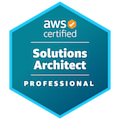

# About Me

- 🔭 I’m currently working on sustainability platforms, large language models, and container platforms!
- 🌱 I’m currently learning ML & AI development.
- 📖 Check out my [documentation](https://stewartmoreland.github.io/docs)
- 💬 Ask me about containers and anything Kubernetes.
- 📫 How to reach me: [LinkedIn](https://linkedin.com/in/stewartmoreland)

## Live GitHub Stats

## Certifications

